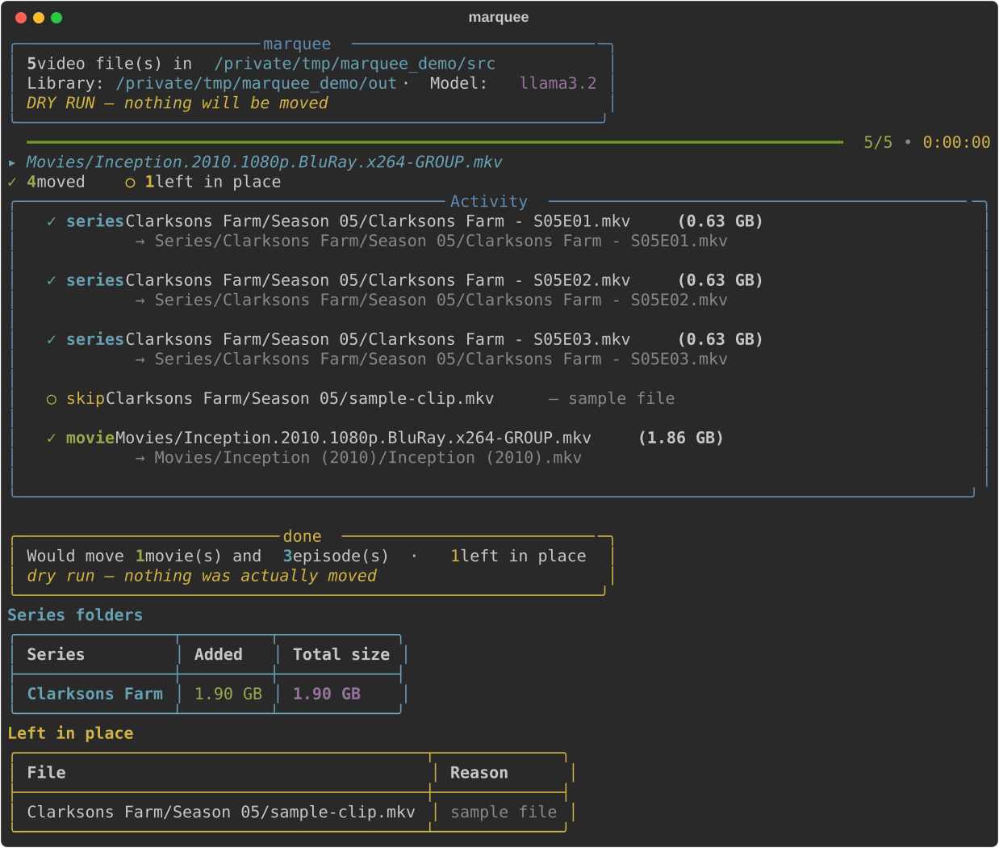

# marquee

[](https://github.com/b-vanstraaten/marquee/actions/workflows/tests.yml)

*Why "marquee"? The word descends from Medieval Latin* marca *— a boundary,
a marked frontier — by way of French* marquise*, the marquis's tent, before
it settled into English as the illuminated sign out front announcing what's
playing. The lineage is fitting: this tool draws the boundary between an
undifferentiated downloads folder and a properly marked library, then hangs
the sign.*

Sorts downloaded movies and TV episodes from a downloads folder into an
organized media library, using a local [Ollama](https://ollama.com) model to
name things and plain regex to keep it honest.

```
<output>/Movies/<Title> (<year>)/<Title> (<year>).<ext>
<output>/Series/<Series Name>/Season <NN>/<Series Name> - S<NN>E<NN>.<ext>
```

Anything that can't be classified confidently is left in place and listed at
the end of the run — nothing gets moved on a guess.

While it runs, a progress bar and a rolling activity panel show what's
happening in place, rather than scrolling an endless per-file transcript.

## Installation

### Homebrew (recommended)

```sh
brew tap b-vanstraaten/marquee
brew trust b-vanstraaten/marquee   # required once: Homebrew won't load formulae from third-party taps otherwise
brew install marquee
```

This installs `marquee` as a standalone CLI in its own isolated virtual
environment — no Python setup of your own required. It also pulls in
[Ollama](https://ollama.com) itself as a dependency, so you don't need to
install that separately.

### From source

```sh
git clone https://github.com/b-vanstraaten/marquee.git
cd marquee
uv sync
uv run marquee --help
```

If you installed from source, you'll also need [Ollama](https://ollama.com)
itself.

Either way, Ollama needs to actually be running with a model pulled:

```sh
ollama serve &
ollama pull llama3.2
```

If either of those hasn't happened, `marquee` checks for it upfront and
tells you exactly what's missing (start the server, or which model to pull)
before it does anything else — rather than failing partway through a run.

## How it works

1. The source folder is scanned recursively for video files, including into
   symlinked directories (common for download-client categories or hardlinked
   libraries) — a plain glob wouldn't follow those.
2. A regex pass extracts what release names encode reliably: `SxxEyy` /
   `1x02` markers (including multi-episode `S01E01-E02`), years, and the
   title text. Sample files are skipped outright.
3. Files that look like they're still downloading are skipped: a
   `.part`/`.!qB`/`.crdownload` sibling marker is checked first, and if
   that's inconclusive, the OS is asked directly whether any process
   currently has the file open (`lsof`) — more reliable than guessing from
   a modification timestamp, which can't tell a finished-just-now file from
   a paused download that's been idle for a while.
4. The Ollama model classifies the file (movie / series / ambiguous) and
   produces a clean title, with the regex hints and the library's existing
   folder names in the prompt.
5. The two are reconciled with the regex as ground truth: season/episode
   numbers from the filename override the model's; a "movie" verdict on a
   file with an episode marker is demoted to ambiguous; a model title that
   shares no words with the filename's title text falls back to the
   filename's own title for a series (season/episode are already
   regex-confirmed), or is rejected outright for a movie.
6. Titles are snapped to existing library folders (case, punctuation, and
   spacing insensitive) so "Daredevil.Born.Again" lands in an existing
   "Daredevil - Born Again" instead of creating a near-duplicate folder.
7. Matching subtitles (`.srt`/`.ass`/... with the same stem, or in the
   release's `Subs/` folder) move along with the video, renamed to match so
   Plex/Jellyfin picks them up. Language tags are preserved.
8. Moves are verified, not just attempted: an atomic rename is used when
   possible, and when it isn't (moving across filesystems), the copy is
   checked against the source's size and the source is only removed once
   that's confirmed — so a crash mid-copy can't strand a corrupt file in
   the library. A destination volume without enough free space is reported
   and skipped rather than attempted.
9. After a real (non-dry-run) move, source folders left completely empty
   are always cleaned up, and by default so are folders left holding only
   release junk (`.nfo`, `.txt`, screenshots, ...) -- pass `--no-prune` to
   leave those in place.
10. Every run's moves are recorded in `<output>/.marquee-undo.json`;
    `--undo` reverses the most recent run.

## Usage

```sh
# Always preview first
marquee --source ~/Downloads --output ~/Media --dry-run

# Real run (also removes source folders left holding only junk, by default)
marquee --source ~/Downloads --output ~/Media

# Real run, leaving junk-only source folders in place instead
marquee --source ~/Downloads --output ~/Media --no-prune

# Changed your mind? Reverse the last run (preview with --dry-run first)
marquee --output ~/Media --undo --dry-run
marquee --output ~/Media --undo
```

`~/Downloads` and `~/Media` are the defaults, so if that matches your setup
you can just run `marquee --dry-run` with no flags at all.

(If you installed from source rather than via Homebrew, prefix these with
`uv run`.)

### Example output



All flags (see `--help` for the authoritative list):

| Flag | Purpose |
| --- | --- |
| `--source` | Folder to scan recursively (default: `~/Downloads`) |
| `--output` | Root folder to move sorted files into (default: `~/Media`) |
| `--model` | Ollama model to use for classification (default: `llama3.2`) |
| `--host` | Ollama server URL (default: `http://localhost:11434`) |
| `--dry-run` | Show what would happen without moving anything |
| `--limit N` | Only process the first N files (trial runs) |
| `--min-confidence {low,medium,high}` | Threshold for moving a file (default: `medium`) |
| `--min-size-mb X` | Skip video files smaller than X MB |
| `--prune` / `--no-prune` | Remove source folders left holding only junk (`.nfo`, `.txt`, screenshots) -- on by default, `--no-prune` disables it; empty folders are always cleaned up regardless |
| `--undo` | Reverse the most recent run (moves files back where they came from) |
| `--timeout` | Per-file timeout in seconds for the Ollama request (default: `120`) |
| `--json-mode-only` | For Ollama versions without JSON-schema constrained output |
| `--verbose` | Show debug logging, including the model's raw response per file |

## Tests

```sh
uv run python -m unittest discover -s tests
```
